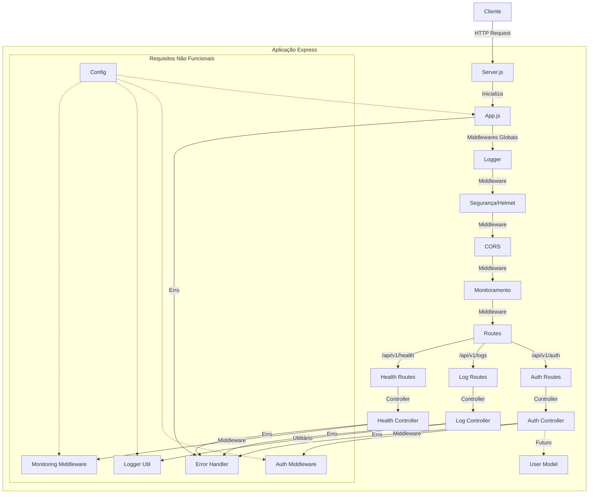
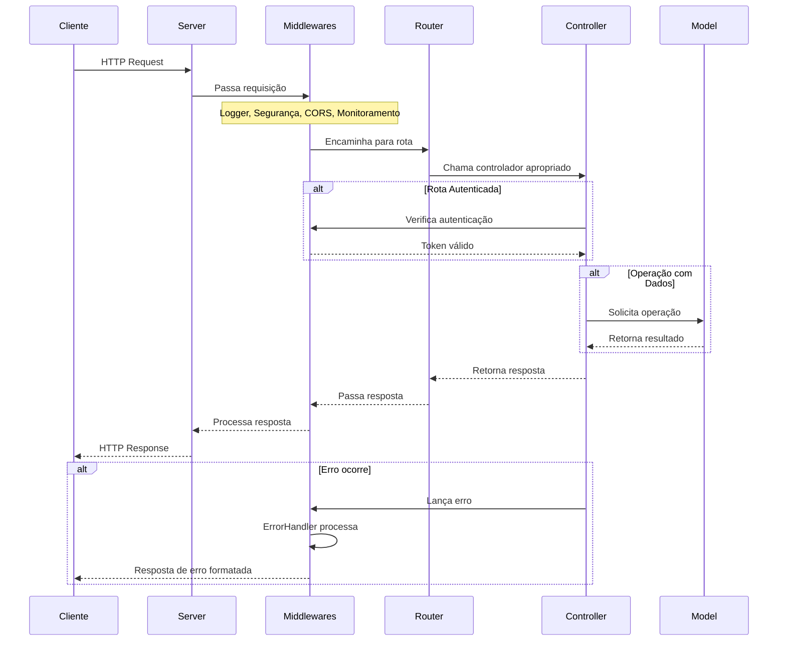
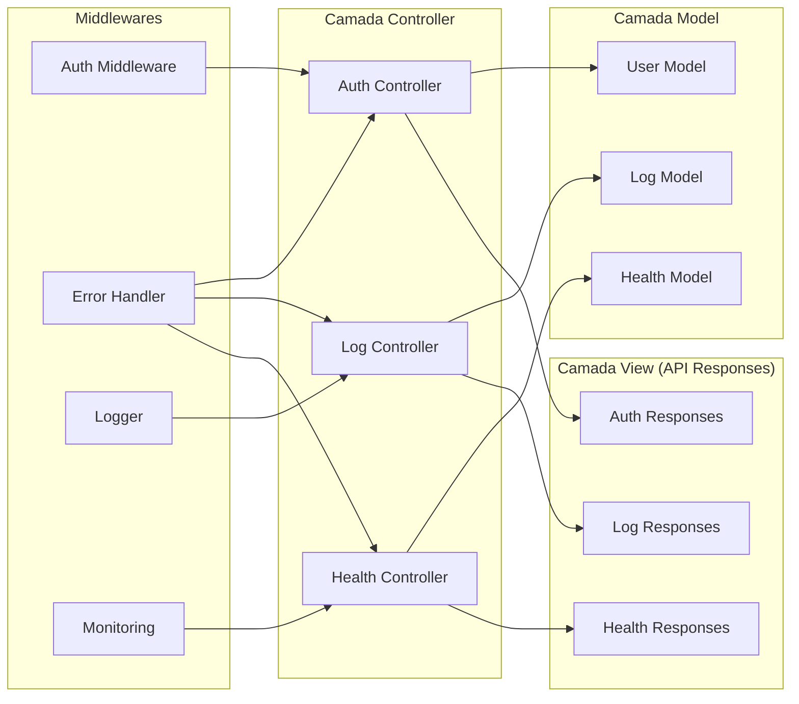

```mermaid
graph TD
    Client[Cliente] -->|HTTP Request| Server[Server.js]
    
    subgraph "Aplicação Express"
        Server -->|Inicializa| App[App.js]
        App -->|Middlewares Globais| MW1[Logger]
        MW1 -->|Middleware| MW2[Segurança/Helmet]
        MW2 -->|Middleware| MW3[CORS]
        MW3 -->|Middleware| MW4[Monitoramento]
        MW4 -->|Middleware| Routes[Routes]
        
        Routes -->|/api/v1/auth| AuthRoutes[Auth Routes]
        Routes -->|/api/v1/logs| LogRoutes[Log Routes]
        Routes -->|/api/v1/health| HealthRoutes[Health Routes]
        
        AuthRoutes -->|Controller| AuthController[Auth Controller]
        LogRoutes -->|Controller| LogController[Log Controller]
        HealthRoutes -->|Controller| HealthController[Health Controller]
        
        AuthController -->|Middleware| AuthMiddleware[Auth Middleware]
        AuthController -.->|Futuro| UserModel[User Model]
        LogController -->|Utilitário| Logger[Logger Util]
        HealthController -->|Middleware| MonitoringMiddleware[Monitoring Middleware]
        
        subgraph "Requisitos Não Funcionais"
            AuthMiddleware
            Logger
            ErrorHandler[Error Handler]
            Config[Config]
            MonitoringMiddleware
        end
    end
    
    App -->|Erro| ErrorHandler
    AuthController -->|Erro| ErrorHandler
    LogController -->|Erro| ErrorHandler
    HealthController -->|Erro| ErrorHandler
    
    Config -.-> App
    Config -.-> AuthMiddleware
    Config -.-> Logger
    Config -.-> MonitoringMiddleware
```

```mermaid
sequenceDiagram
    participant Cliente
    participant Server
    participant Middlewares
    participant Router
    participant Controller
    participant Model
    
    Cliente->>Server: HTTP Request
    Server->>Middlewares: Passa requisição
    Note over Middlewares: Logger, Segurança, CORS, Monitoramento
    
    Middlewares->>Router: Encaminha para rota
    Router->>Controller: Chama controlador apropriado
    
    alt Rota Autenticada
        Controller->>Middlewares: Verifica autenticação
        Middlewares-->>Controller: Token válido
    end
    
    alt Operação com Dados
        Controller->>Model: Solicita operação
        Model-->>Controller: Retorna resultado
    end
    
    Controller-->>Router: Retorna resposta
    Router-->>Middlewares: Passa resposta
    Middlewares-->>Server: Processa resposta
    Server-->>Cliente: HTTP Response
    
    alt Erro ocorre
        Controller->>Middlewares: Lança erro
        Middlewares->>Middlewares: ErrorHandler processa
        Middlewares-->>Cliente: Resposta de erro formatada
    end
```

```mermaid
graph LR
    subgraph "Camada Model"
        UserModel[User Model]
        LogModel[Log Model]
        HealthModel[Health Model]
    end
    
    subgraph "Camada Controller"
        AuthController[Auth Controller]
        LogController[Log Controller]
        HealthController[Health Controller]
    end
    
    subgraph "Camada View (API Responses)"
        AuthResponse[Auth Responses]
        LogResponse[Log Responses]
        HealthResponse[Health Responses]
    end
    
    AuthController --> UserModel
    LogController --> LogModel
    HealthController --> HealthModel
    
    AuthController --> AuthResponse
    LogController --> LogResponse
    HealthController --> HealthResponse
    
    subgraph "Middlewares"
        Auth[Auth Middleware]
        Error[Error Handler]
        Logging[Logger]
        Monitor[Monitoring]
    end
    
    Auth --> AuthController
    Logging --> LogController
    Monitor --> HealthController
    Error --> AuthController
    Error --> LogController
    Error --> HealthController
```
